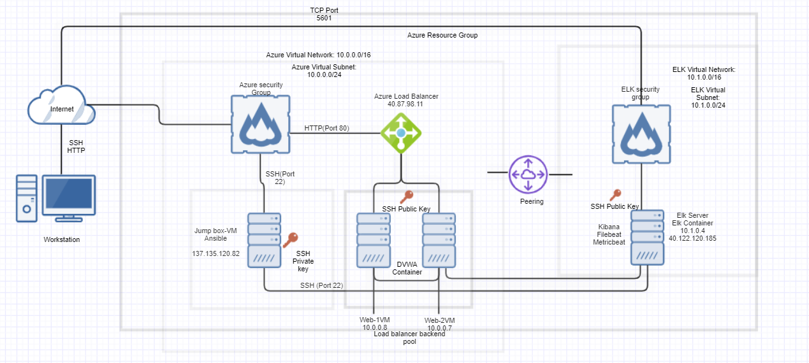

## Automated ELK Stack Deployment

The files in this repository were used to configure the network depicted below.

These files have been tested and used to generate a live ELK deployment on Azure. They can be used to either recreate the entire deployment pictured above. Alternatively, select portions of the playbook files may be used to install only certain pieces of it, such as Filebeat.

  -metricbeat_playbook.yml
  -pentest.yml
  -filebeat-playbook.yml
  -install-elk.yml

This document contains the following details:
- Description of the Topology
- Access Policies
- ELK Configuration
  - Beats in Use
  - Machines Being Monitored
- How to Use the Ansible Build

### Description of the Topology

The main purpose of this network is to expose a load-balanced and monitored instance of DVWA, the D*mn Vulnerable Web Application.

Load balancing ensures that the application will be highly available, in addition to restricting access to the network.
-Load balancers touch on the availability aspect of the cybersecurity triad. A jump box gives the ability to manage multiple systems form one location, increasing security.

Integrating an ELK server allows users to easily monitor the vulnerable VMs for changes to the configuration and system logs.
- Filebeat watches for any changes made to a system, gives an administrator the ability to easily compile logs for analysis.
- Metricbeat allows for easy compilation and analysis of metrics on a system. Cpu usage, disk usage and so on.

The configuration details of each machine may be found below.

| Name     | Function | IP Address    | Operating System |
|----------|----------|---------------|------------------|
| Jump Box | Gateway  |137.135.120.82 | Linux            |
| Web 1    |          | 10.0.0.8      | Linux            |
| Web 2    |          | 10.0.0.7      | Linux            |
| Elk      |          | 10.1.0.4      | Linux            |
                        40.122.120.185

### Access Policies

The machines on the internal network are not exposed to the public Internet. 

Only the Jump box machine can accept connections from the Internet. Access to this machine is only allowed from the following IP addresses:
- 97.92.33.60

Machines within the network can only be accessed by fervent_cohen docker container.

A summary of the access policies in place can be found in the table below.

| Name     | Publicly Accessible | Allowed IP Addresses |
|----------|---------------------|----------------------|
| Jump Box | Yes                 |   97.92.33.60        |
| Web1     | No                  |                      |
| Web2     | No                  |                      | 
  Elk      | No                  |                      |

### Elk Configuration

Ansible was used to automate configuration of the ELK machine. No configuration was performed manually, which is advantageous because...
- All machines can be rapidly configured in the exact same way.

The playbook implements the following tasks:
- Download and install docker
- Download and install elk
- Configure and start the container and server.

The following screenshot displays the result of running `docker ps` after successfully configuring the ELK instance.

~/OneDrive/Desktop/Screenshots/docker_ps_output.PNG

### Target Machines & Beats
This ELK server is configured to monitor the following machines:
-10.0.0.7
-10.0.0.8

We have installed the following Beats on these machines:
- filebeat
-metricbeat

These Beats allow us to collect the following information from each machine:
- Filebeat will collect change logs of files on the system while metric beat gathers system metrics.

### Using the Playbook
In order to use the playbook, you will need to have an Ansible control node already configured. Assuming you have such a control node provisioned: 

SSH into the control node and follow the steps below:
- Copy the config file to ansible container.
- Update the ansible config file to include the ip addresses of the desired machines
- Run the playbook, and navigate to http://40.122.120.185:5601/app/kibana#/home to check that the installation worked as expected.

